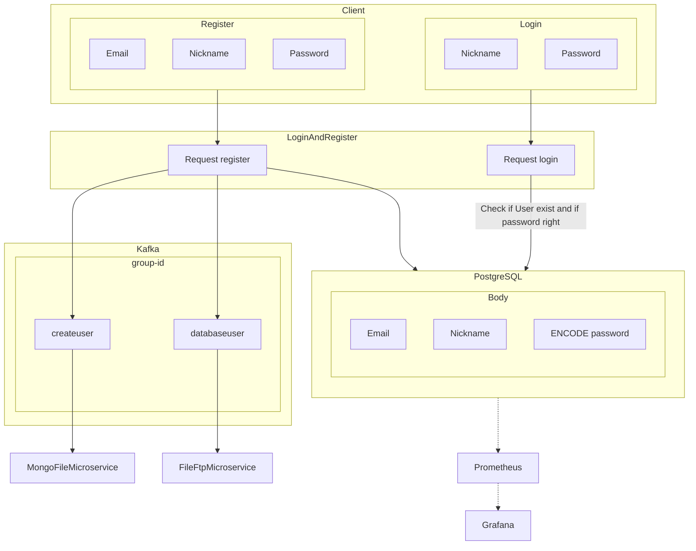

"# LoginAndRegister" 

### Functions:

1. **Register**:
    
    - The registration request uses a body where the user provides their nickname, email, and password.
    - Before proceeding, a function checks if a user with the provided nickname already exists.
    - If the nickname is not found, a DTO class is created, where the nickname, email, and encoded password (using PasswordEncoder from the Spring Security dependency) are set and saved in the PostgreSQL database.
    - After that, Kafka messages are sent to the FileFtpMicroservice (to create a folder with the user's nickname where all user files and folders will be saved) and to the FileMongoMicroservice.
2. **Login**:
    
    - The login request uses a body where the user sends their nickname.
    - Using AuthenticationManager and UsernamePasswordAuthenticationToken (Spring Security dependency), it checks if the user has provided the correct nickname and password.

### In the next version:

- Add functionality to send an email to the user about successful registration and, if the user forgets their password, send a new password to the user (considering using Redis Cache Database for this).

Diagram of microservice:

